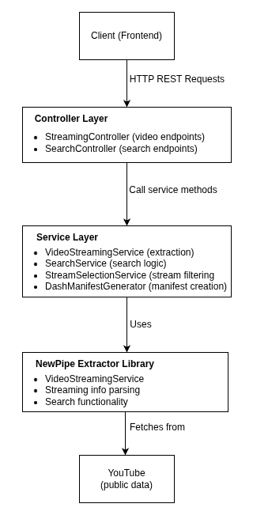

# New Pipe Extractor API

Spring Boot REST API THAT wraps the [NewPipeExtractor](https://github.com/TeamNewPipe/NewPipeExtractor) library
to provide YouTube video metadata, search functionality, and optimised DASH manifest generation for the OpenTube platform.

## Purpose

This API serves as the backend data layer for OpenTube, providing:

 1. **Video Metadata Extraction** - Comprehensive video information from YouTube
 2. **Search Functionality** - Full-featured search with pagination and filtering
 3. **DASH Manifest Generation** - Server-side creation of optimised steaming manifest
 4. **Stream Selection** - Intelligent filtering of video/audio streams
 5. **Related Content** - Video recommendations and related items

By wrapping NewPipe Extractor in a REST API, we enable:
 - **Centralised** data processing and optimisation
 - **Consistent** error handling and response formats
 - **Effcient** caching and stream selection

## Architecture Overview




## Key Features

### 1. Intelligent Stream Selection

Video Selection Strategy
- Select 3-6 quality levels (144p → 4K)
- Prioritize standard resolutions (720p, 1080p, etc.)
- Ensure minimum quality diversity
- Sort by quality for optimal player behavior

Audio Selection Strategy
- One stream per language
- Prefer M4A/AAC format (better compatibility)
- Prioritize by itag (known quality levels)
- Fall back to highest bitrate

Subtitle Selection Strategy
- Deduplicate by language
- Prefer manual over auto-generated
- Filter by format (VTT preferred)
- Sort by language priority (original → English → others)

### 2. DASH Manifest Generation

**DASH Manifest Structure**:
```xml
<MPD>
  <Period duration="PT10M30S">
    <!-- Video AdaptationSet -->
    <AdaptationSet contentType="video" mimeType="video/mp4">
      <Representation id="137" bandwidth="4000000" width="1920" height="1080">
        <BaseURL>https://proxy:8081/?host=...&itag=137</BaseURL>
      </Representation>
      <Representation id="136" bandwidth="2500000" width="1280" height="720">
        <BaseURL>https://proxy:8081/?host=...&itag=136</BaseURL>
      </Representation>
      <!-- More quality levels -->
    </AdaptationSet>
    
    <!-- Audio AdaptationSets (one per language) -->
    <AdaptationSet contentType="audio" mimeType="audio/mp4" lang="en">
      <Representation id="140" bandwidth="128000">
        <BaseURL>https://proxy:8081/?host=...&itag=140</BaseURL>
      </Representation>
    </AdaptationSet>
    
    <!-- Subtitle AdaptationSets -->
    <AdaptationSet contentType="text" mimeType="text/vtt" lang="en">
      <Representation id="subtitle-en">
        <BaseURL>https://example.com/subtitles/en.vtt</BaseURL>
      </Representation>
    </AdaptationSet>
  </Period>
</MPD>
```

### 3. Comprehensive Error Handling

`ApiException (Base)`
 - `ValidationException` (400 Bad Request)
    - Missing parameters
    - Invalid URL format
    - Empty search Strings
 - `ExtractionException` (500 Server Error)
    - NewPipe extracton failures
    - YouTube unavailable
    - Network errors
`GlobalExceptionHandler` catches all:
 - Returns consisten JSON erros responses
 - Logs errors appropriately
 - Provides error codes for debugging

Error Response Format:
```json
{
  "status": 400,
  "error": "Bad Request",
  "message": "Required parameter 'id' is missing",
  "errorCode": "MISSING_PARAMETER",
  "timestamp": "2024-12-18T10:30:00Z",
  "path": "/api/v1/streams"
}
```

### 4. Search with Deduplication

YouTube search results can contain:
 - Duplicate videos with different URLs
 - Mixed content (videos, playlists, channels)
 - Auto-generated content

**SearchService** handles this:

 1. Filter: Only keep videos (exclude playlists/channels)
 2. Deduplicate: Remove duplicates by URL
 3. Paginate: Handle next page requests
 4. Format: Convert to consistent DTOs

## Getting Started

### Prerequisites

- **Java 17+** (JDK 17 or higher)
- **Maven 3.6+**
- **Git**

### Installation

```bash
# Clone the repository
git clone https://github.com/VimVoyager/NewPipeExtractorApi.git
cd NewPipeExtractorApi/app

# No additional dependencies to install - Maven handles everything
```

### Configuration

Create `src/main/resources/application.properties`:

```properties
# Server Configuration
server.port=8080
server.address=0.0.0.0

# CORS Configuration
# Update with your frontend URLs
cors.allowed.origins=http://localhost:5173,http://localhost:3000

# Logging
logging.level.org.example.api=INFO
logging.level.org.schabi.newpipe=WARN

# OkHttp Timeouts (in seconds)
okhttp.read.timeout=30
okhttp.connect.timeout=30

# Jackson JSON Configuration (handled in code)
spring.jackson.serialization.indent-output=true
spring.jackson.default-property-inclusion=non_null
```

### Running the API

#### Development Mode

```bash
# Using Maven wrapper (recommended)
./mvnw spring-boot:run

# Or with Maven installed
mvn spring-boot:run

# With custom profile
./mvnw spring-boot:run -Dspring-boot.run.profiles=dev
```

#### Production Build

```bash
# Build JAR
./mvnw clean package -DskipTests

# Run JAR
java -jar target/newpipe-extractor-api-*.jar

# Or with production profile
java -jar -Dspring.profiles.active=prod target/newpipe-extractor-api-*.jar
```

### Verify Installation

```bash
# Check if API is running
curl http://localhost:8080/api/v1/streams?id=dQw4w9WgXcQ

# Should return StreamInfo JSON
```

## Testing

### Run All Tests

```bash
mvn test
```

### Run Specific Test Class

```bash
mvn test -Dtest=StreamingControllerTest
```

### Run with Coverage

```bash
mvn test jacoco:report

# View report at: target/site/jacoco/index.html
```

## Authors

- [@VimVoyager](https://www.github.com/VimVoyager)

